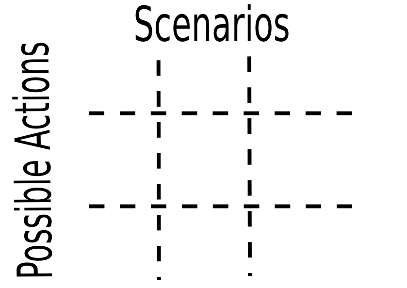
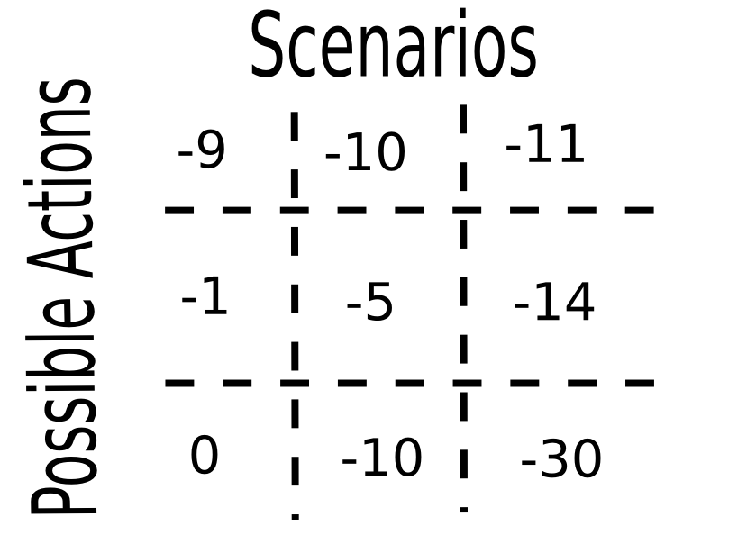
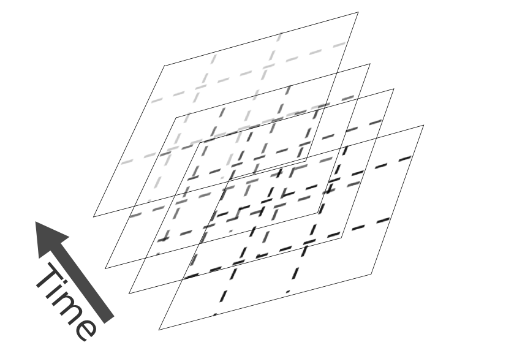
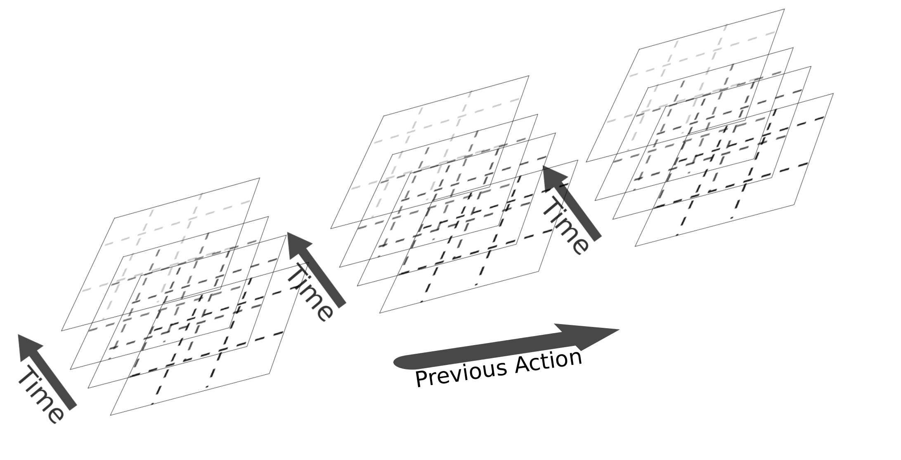

<!-- 
Time: 30 minutes with questions
Presenting at: 2014-12-08 15:10:00 PDT
-->


## Our world is changing


<small> Overpeck+ (2011) doi: [10.1126/science.1197869](http://doi.org/10.1126/science.1197869) </small>

## Our policies are not


<small> Alex Wong (Getty Images) </small>


```{r configure, include=FALSE, cache=FALSE}
#source("components/install.R")

library("methods")
library("knitr")
basename <- "presentation"
opts_chunk$set(fig.path = paste("components/figure/", basename, "-", sep=""),
               cache.path = paste("components/cache/", basename, "/", sep=""))
opts_chunk$set(cache = 2)
opts_chunk$set(tidy=FALSE, warning=FALSE, message=FALSE, 
               comment = NA, verbose = TRUE, echo=FALSE)
# PDF-based figures
opts_chunk$set(dev='pdf')
fig.cache <- TRUE

library("rmarkdown")
library("pdgControl")
library("reshape2")
library("plyr")
library("ggplot2")
library("data.table")
library("pander")
library("cboettigR")
library("ggthemes")
library("snowfall")

theme_set(theme_tufte(base_size=18))
```
```{r analysis, include=FALSE}
source("components/analysis.R")
```


----


<small> NOAA </small>

## Bluefin Tuna Stocks vs US Quota, ICCAT 1987 - 2007
 
 
```{r Figure_1, fig.cap="Quota on Blue Fin Tuna Catch", dev=c("svg", "png"), cache=FALSE}
tuna <- read.csv("components/data/tuna.csv")
tuna<-melt(tuna, id="year")
ggplot(tuna, aes(year, value)) + geom_point() +
  facet_wrap(~variable, ncol=1, scale="free_y") + 
  ylab("Bluefin Tuna harvest (tonnes)") + theme_bw()

```


## dynamic optimization, dynamic policies


----


----


----



----



----


----



----




<!--
## Postulate: policy intertia

> Policies are costly to change

## We're quite good at accounting for _ecological_ dynamics

---- 

<small> Reed (1979) [10.1016/0095-0696(79)90014-7](http://doi.org/10.1016/0095-0696(79)90014-7) </small>

## Not so good at _policy_ dynamics

- We account for ecological dynamics but not political ones
- We're not political scientists, we don't know the equations of politics (does anyone?)
- Instead, we can investigate the potential impact that costly adjustments have on optimal policy

-->

Fish population dynamics (state equation)
-----------------------------------------


$$N_{t+1} = Z_t \frac{A (N_t - h_t)}{1 + B (N_t - h_t)}$$

Optimization
------------

$$\max_{{\bf h}}\mathbf{ E} ( NPV_{0} )=\max_{{\bf h}} \sum_0^\infty \mathbf{E} \left(\frac{\Pi_0(N_t,h_t)}{(1+\delta)^{t+1}} \right)$$


$$\Pi_0(N_t,h_t) = p h_t -  c_0 E_t $$


Costs of policy adjustment 
--------------------------

We replace $\Pi_0$ in the $NPV_0$ equation with

$$\Pi_{1}(N_t,h_t, h_{t-1}) = \Pi_0 - c_1  |  h_t - h_{t-1} | \,.$$

$$\Pi_{2}(N_t,h_t, h_{t-1}) = \Pi_0 - c_2 (  h_t - h_{t-1})^2 \,.$$

$$\Pi_{3}(N_t,h_t, h_{t-1}) = \Pi_0 - c_3 (1-\mathbf{I}(h_t, h_{t-1}))  \,,$$


Apples to Apples 
--------------------


```{r Figure_2, fig.cap="",  dev=c("svg", "png"), cache=FALSE}

relabel <- c(L1 = substitute(paste(Pi[1])),
             L2 = substitute(paste(Pi[2])),
             fixed = substitute(paste(Pi[3])))

ggplot(fees, aes(c2, (npv0-value)/npv0, color=variable)) + 
  geom_line(lwd=1) + 
  geom_hline(aes(yintercept=reduction), linetype=4) + 
  xlab("Penalty coefficient") +
  ylab("Reduction in net present value") + 
  scale_color_discrete(labels=relabel) 


```


Effect of policy adjustment costs on optimal quotas and stock sizes 
-------------------------------------------------------------------


```{r Figure_3, dependson="tidy", fig.cap="", dev=c("svg", "png"), cache=FALSE}

fig3_df <- as.data.frame(subset(dt, replicate=='rep_17'))
fig3_df <- fig3_df[c("time", "fishstock", "alternate", "harvest", "harvest_alt", "penalty_fn")]
fig3_df <- melt(fig3_df, id = c("time", "penalty_fn"))
fig3_df <- data.frame(fig3_df, baseline = fig3_df$variable)
variable_map <- c(fishstock = "fish_stock", alternate = "fish_stock", harvest = "harvest", harvest_alt = "harvest")
baseline_map <- c(fishstock = "penalty", alternate = "no_penalty", harvest = "penalty", harvest_alt = "no_penalty")
fig3_df$variable <- variable_map[fig3_df$variable]
fig3_df$baseline <- baseline_map[fig3_df$baseline]

harvest_fig3 <- subset(fig3_df, variable=="harvest")
fishstock_fig3 <- subset(fig3_df, variable=="fish_stock")

labeller <- function(variable,value){
    return(relabel[value])
}

ggplot(harvest_fig3, aes(time, value, col=baseline)) +
  geom_line(lwd=1) +
  facet_grid(penalty_fn~., labeller = labeller) + 
  labs(x="time", y="stock size", title = "Example Harvest Dynamics")  +
  scale_color_discrete(labels=c("Reed solution", "With penalty"), name="")
```


## Figure 4


```{r Figure_4, fig.cap="", dev=c("svg", "png"), cache=FALSE}
ggplot(subset(figure4_df, statistic != "cross.correlation"), 
       aes(penalty_fraction, value, fill=penalty_fn, col=penalty_fn))  +
  stat_summary(fun.y = mean, 
               fun.ymin = function(x) mean(x) - sd(x), 
               fun.ymax = function(x) mean(x) + sd(x), 
               geom = "ribbon", alpha=0.3, colour=NA) +
  stat_summary(fun.y = mean, geom = "line") + 
  coord_cartesian(xlim = c(0, .3)) + 
  facet_wrap(~ timeseries + statistic, scale="free_y") + 
  scale_color_discrete(labels=relabel, name="Penalty function") + 
  scale_fill_discrete(labels=relabel, name="Penalty function") + 
  xlab("Penalty size (as fraction of NPV0)")

write.csv(figure4_df, "components/data/figure4.csv")
```


Consequences of policy adjustment costs 
---------------------------------------

```{r histogram-calc}
profits <- dt[, sum(profit_fishing), by=c('penalty_fn', 'replicate') ]
costs <- dt[, sum(policy_cost), by=c('penalty_fn', 'replicate') ]
reed_profits <- dt[, sum(profit_fishing_alt), by=c('penalty_fn', 'replicate') ]
reed_costs <- dt[, sum(policy_cost_alt), by=c('penalty_fn', 'replicate') ]
setnames(profits, "V1", "profits")
setnames(reed_profits, "V1", "profits")

Reed <- cbind(reed_profits, costs = reed_costs$V1, Assumption = "Reed") 
Adj <- cbind(profits, costs = costs$V1, Assumption = "Adjustment penalty")

hist_dat <- melt(rbind(Adj, Reed), id=c("penalty_fn", "replicate", "Assumption"))
````


```{r Figure_5, fig.cap="",  dependson="histogram-calc", dev=c("svg", "png"), cache=FALSE}

assume <- levels(as.factor(hist_dat$Assumption))
labeller <- function(variable,value){
if (variable=='penalty_fn') {
    return(relabel[value])
  } else {
    return(assume[value])
  }
}

ggplot(hist_dat) + 
  geom_density(aes(value, fill=variable, color=variable), alpha=0.8)+
  facet_grid(Assumption~penalty_fn, labeller = labeller)

write.csv(hist_dat, "components/data/figure5.csv")
```


## Penalty


$$NPV_i( h_1^* ) = \sum_{t=0}^\infty (\overbrace{ p h^*_{1,t}-c_0E^*_{1t}}^{[1]}-\overbrace{c_1 | h^*_{1,t}- h^*_{1,t-1}|}^{[2]} )  \frac{1}{(1+\delta)^t}$$


$$NPV_i( h_0^* ) = \sum_{t=0}^\infty (\underbrace{ p h^*_{0,t}-c_0E^*_{0t}}_{[3]}-\underbrace{c_1 | h^*_{0,t}- h^*_{0,t-1}|}_{[4]} )  \frac{1}{(1+\delta)^t}$$


## Figure 6


```{r Figure_6, fig.cap="", dev=c("svg", "png"), cache=FALSE}

who <- c("penalty_fn", "ignore_fraction", "assume_fraction", "reduction")
table1 <- arrange(error_df[who], reduction) 
names(table1) = c("penalty.fn", "ignoring", "assuming", "reduction")
table1_long <- melt(table1, id = c('penalty.fn', 'reduction'))
table1_long$reduction <- as.factor(table1_long$reduction)
table1_long <- subset(table1_long, reduction != "0.3")
ggplot(table1_long, aes(penalty.fn, value, fill = variable)) + 
  geom_bar(stat="identity", position="dodge") + 
  facet_wrap(~reduction, ncol=2) + 
  scale_x_discrete(labels = c('L1' = substitute(paste(Pi[1])),
                              'L2' = substitute(paste(Pi[2])),
                              'fixed' = substitute(paste(Pi[3])))) + 
  xlab("Penalty function")
```

## Mismatches


```{r Figure_7, fig.cap="", dev=c("svg", "png"), cache=FALSE}
who <- c("penalty_fn", "ignore_fraction", "mismatched_fraction", "reduction")
table2 <- arrange(mismatches_df[who], reduction) 
names(table2) = c("penalty.fn", "ignoring", "mismatched", "reduction")
table2_long <- melt(table2, id = c('penalty.fn', 'reduction'))
table2_long$reduction <- as.factor(table2_long$reduction)

ggplot(table2_long, aes(penalty.fn, value, fill = variable)) + 
  geom_bar(stat="identity", position="dodge") + 
  facet_wrap(~reduction, scales="free_y") +
  scale_x_discrete(labels = c('L1_L2' = substitute(paste(Pi[1],"_", Pi[2])), 
                              'L2_L1' =  substitute(paste(Pi[2],"_", Pi[1])),
                              'L1_fixed' = substitute(paste(Pi[1],"_", Pi[3])), 
                              'fixed_L1' =  substitute(paste(Pi[3],"_", Pi[1])),
                              'fixed_L2' = substitute(paste(Pi[3],"_", Pi[2])), 
                              'L2_fixed' =  substitute(paste(Pi[2],"_", Pi[3])))) + 
  xlab("Penalty function") + theme_tufte(base_size=14)
```


```{r bluefin_landings, dev=c("svg", "png"), eval=FALSE}
landings <- data.table(read.csv("components/data/iccat.csv"))
bluefin <- landings[Species == "BFT" & PartyName=="UNITED STATES" & YearC %in% 1987:2007,]
ggplot(bluefin, aes(x=YearC,y= Qty_t)) + 
  stat_summary(fun.y = "sum", geom="line") + 
  xlab("Year")+ylab("Catch (tonnes)")

#library("rfisheries")
#landings <- of_landings(species="BFT")
#landings <- landings[landings$year %in% 1982:2007,]
#ggplot(landings, aes(year, catch)) + geom_line() + ylab("Global landings (tonnes)")
```


