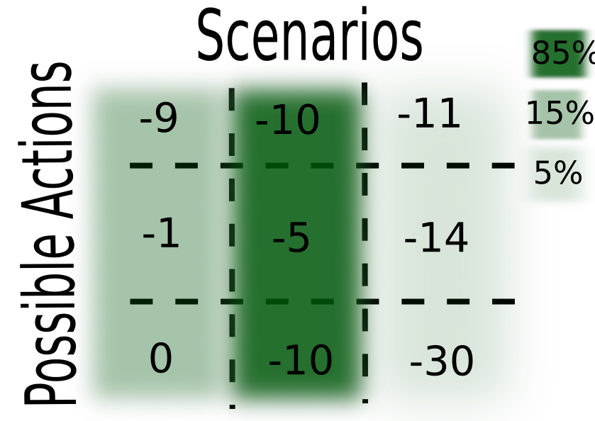

## Our world is changing


<small> Overpeck+ (2011) doi: [10.1126/science.1197869](http://doi.org/10.1126/science.1197869) </small>

## Our policies are not


<small> Alex Wong (Getty Images) </small>


```{r configure, include=FALSE, cache=FALSE}
#source("components/install.R")

library("methods")
library("knitr")
basename <- "presentation"
opts_chunk$set(fig.path = paste("components/figure/", basename, "-", sep=""),
               cache.path = paste("components/cache/", basename, "/", sep=""))
opts_chunk$set(cache = 2)
opts_chunk$set(tidy=FALSE, warning=FALSE, message=FALSE, 
               comment = NA, verbose = TRUE, echo=FALSE)
# PDF-based figures
opts_chunk$set(dev='pdf')
fig.cache <- TRUE

library("rmarkdown")
library("pdgControl")
library("reshape2")
library("plyr")
library("ggplot2")
library("data.table")
library("pander")
library("cboettigR")
library("ggthemes")
library("snowfall")
library("tidyr")
library("dplyr")
transparent = theme(
    panel.background = element_rect(fill = "transparent",colour = NA), 
    plot.background = element_rect(fill = "transparent",colour = NA))

theme_set(theme_bw(base_size=18) + transparent)
```

```{r analysis, include=FALSE}
source("components/analysis.R")
```


----


## Natural populations fluctuate...

```{r ex_fish, fig.cap="", dev=c("svg", "png"), dev.args=list(bg="transparent")}
ex <- filter(dt, replicate=="rep_17" & penalty_fn == "L1" & time < 20)
ggplot(ex) + 
  geom_line(aes(time, fishstock), col="darkblue", lwd=1)
```


## So then, do our optimal policies

```{r ex_harvest, fig.cap="", dev=c("svg", "png"), dependson="ex_fish", dev.args=list(bg="transparent")}
ggplot(ex) + 
  geom_line(aes(time, harvest_alt), col="darkgreen", lwd=1) +
  ylab("Optimal quota policy") 
```


## Real policies: not so much


<small> NOAA </small>

## Bluefin Tuna Stocks vs Quota (base TAC), ICCAT 1987 - 2007
 
 
```{r Figure_1, fig.cap="Quota on Blue Fin Tuna Catch", dev=c("svg", "png"), cache=FALSE, dev.args=list(bg="transparent")}
tuna <- read.csv("components/data/tuna.csv")
tuna<-melt(tuna, id="year")
ggplot(tuna, aes(year, value)) + geom_point() +
  facet_wrap(~variable, ncol=1, scale="free_y") + 
  ylab("Bluefin Tuna (tonnes)") + theme_bw()

```

<small> base TAC for the stock (before any underages or overages are applied or divided by country)</small>


----

> ## As ecologists, we've ever focused on accounting for _ecological_ dynamics


## Not so good at _policy_ dynamics

- We account for _ecological_ dynamics but not _political_ ones
- We don't know the equations of politics (does anyone?)
- Instead, we can investigate the potential impact that costly adjustments have on optimal policy


Model setup
------------

- Focus on _stochastic_ dynamics: thus a constant harvest is not optimal.  

- Follow the textbook classic approach: __Reed (1979)__ [10.1016/0095-0696(79)90014-7](http://doi.org/10.1016/0095-0696(79)90014-7)

```{r, fig.cap="",  dev=c("svg", "png"), cache=FALSE, dev.args=list(bg="transparent"), fig.height=3}
ex <- dt %>% 
  filter(replicate=="rep_17" & penalty_fn == "L1" & time < 20) %>%
  select(time, fishstock, harvest_alt) %>%
  gather(variable, stock, -time) 
ggplot(ex) + 
  geom_line(aes(time, stock, col=variable), lwd=1) + 
  scale_color_discrete(labels=c(fishstock = "Stock size", harvest_alt = "Harvest policy"), name="") 

```


Fish population dynamics 
--------------------------

### (state equation)

Population grows under a Beverton-Holt stock-recruitment curve, 

$$N_{t+1} = Z_t \frac{A (N_t - h_t)}{1 + B (N_t - h_t)}$$

- subject to multiplicitive log-normal growth shocks $Z_t$

Optimization
------------

Select harvest policy that maximizes the Net Present Value (NPV) of the stock:

$$\max_{{\bf h}}\mathbf{ E} ( NPV_{0} )=\max_{{\bf h}} \sum_0^\infty \mathbf{E} \left(\frac{\Pi_0(N_t,h_t)}{(1+\delta)^{t+1}} \right)$$


- Profits from harvesting depend on price and costs $\Pi_0(N_t,h_t) = p h_t -  c_0 E_t(N_t, h_t) $
- Harvest quota $h_t$ in year $t$
- Stock size $N_t$, measured before harvest
- discount rate $\delta$

### Costs of policy adjustment 

- We replace $\Pi_0$ in the $NPV_0$ equation with...

"Linear costs"
-------------

$$\Pi_{1}(N_t,h_t, h_{t-1}) = \Pi_0 - c_1  |  h_t - h_{t-1} | $$

- All previous terms, minus: 
- The cost to change the harvest policy (quota): proportional to the size of the change


 "Quadratic costs"
-----------------

$$\Pi_{2}(N_t,h_t, h_{t-1}) = \Pi_0 - c_2 (  h_t - h_{t-1})^2 $$


- Small adjustments are very cheap
- Large adjustments are very expensive
- Closest to typical assumptions of quadratic costs on harvest/effort (but hear it is the _change_ in harvest/effort)


 "Fixed costs"
------------


$$\Pi_{3}(N_t,h_t, h_{t-1}) = \Pi_0 - c_3 (1-\mathbb{I}(h_t, h_{t-1}))  $$

- A fixed transaction fee for any change to policy, independent of size. 

<br/>
<br/>
<small>($\mathbb{I(x,y)}$ is indicator function, equals 1 iff $x=y$, zero otherwise.) </small>


Apples to Apples 
------------------

### How do we pick coefficients $c_i$ such that only the functional form and not the overall cost differ? 


Apples to Apples
------------------

```{r Figure_2, fig.cap="",  dev=c("svg", "png"), cache=FALSE, dev.args=list(bg="transparent")}

relabel <- c(L1 = substitute(paste(Pi[1])),
             L2 = substitute(paste(Pi[2])),
             fixed = substitute(paste(Pi[3])))

ggplot(fees, aes(c2, (npv0-value)/npv0, color=variable)) + 
  geom_line(lwd=1) + 
  geom_hline(aes(yintercept=reduction), linetype=4) + 
  xlab("Penalty coefficient") +
  ylab("Reduction in net present value") + 
  scale_color_discrete(labels=relabel) 


```

----

## Problem defined. Time to compute solutions. 


## Implementation: 

### Stochastic Dynamic Programming 


----


----


----


----


----



----


----


Effect of policy adjustment costs on optimal quotas and stock sizes 
-------------------------------------------------------------------

What would you predict for...

- Quadratic adjustment costs?
- Linear adjustment costs?
- Fixed adjustment costs?


```{r reex, fig.cap="", dev=c("svg", "png"), cache=FALSE, dev.args=list(bg="transparent"), fig.height=3}
ggplot(ex) + 
  geom_line(aes(time, stock, col=variable), lwd=1) + 
  scale_color_discrete(labels=c(fishstock = "Stock size", harvest_alt = "Harvest policy"), name="") 
```


Quadratic Costs ($\Pi_2$)
-------------------------

```{r quadratic, fig.cap="", dev=c("svg", "png"), cache=FALSE, dev.args=list(bg="transparent")}
ex <- dt %>% 
  filter(replicate=="rep_17" & penalty_fn == "L2") %>%
  select(time, harvest, harvest_alt) %>%
  gather(variable, value, -time) 
ggplot(ex) + 
  geom_line(aes(time, value, col=variable), lwd=1) + 
  ylab("harvest quota") +
  scale_color_discrete(labels=c(harvest = "adjusted policy", harvest_alt = "baseline policy"), name="") 
```

Fixed Costs ($\Pi_3$)
---------------------

```{r fixed, fig.cap="", dev=c("svg", "png"), cache=FALSE, dev.args=list(bg="transparent")}
ex <- dt %>% 
  filter(replicate=="rep_17" & penalty_fn == "fixed") %>%
  select(time, harvest, harvest_alt) %>%
  gather(variable, value, -time) 
ggplot(ex) + 
  geom_line(aes(time, value, col=variable), lwd=1) + 
  ylab("harvest quota") +
  scale_color_discrete(labels=c(harvest = "adjusted policy", harvest_alt = "baseline policy"), name="") 
```

Linear Costs ($\Pi_1$)
---------------------

```{r linear, fig.cap="", dev=c("svg", "png"), cache=FALSE, dev.args=list(bg="transparent")}
ex <- dt %>% 
  filter(replicate=="rep_17" & penalty_fn == "L1") %>%
  select(time, harvest, harvest_alt) %>%
  gather(variable, value, -time) 
ggplot(ex) + 
  geom_line(aes(time, value, col=variable), lwd=1) + 
  ylab("harvest quota") +
  scale_color_discrete(labels=c(harvest = "adjusted policy", harvest_alt = "baseline policy"), name="") 
```


(For comparison)
----------------

```{r Figure_3, dependson="tidy", fig.cap="", dev=c("svg", "png"), cache=FALSE, dev.args=list(bg="transparent")}

fig3_df <- as.data.frame(subset(dt, replicate=='rep_17'))
fig3_df <- fig3_df[c("time", "fishstock", "alternate", "harvest", "harvest_alt", "penalty_fn")]
fig3_df <- melt(fig3_df, id = c("time", "penalty_fn"))
fig3_df <- data.frame(fig3_df, baseline = fig3_df$variable)
variable_map <- c(fishstock = "fish_stock", alternate = "fish_stock", harvest = "harvest", harvest_alt = "harvest")
baseline_map <- c(fishstock = "penalty", alternate = "no_penalty", harvest = "penalty", harvest_alt = "no_penalty")
fig3_df$variable <- variable_map[fig3_df$variable]
fig3_df$baseline <- baseline_map[fig3_df$baseline]

harvest_fig3 <- subset(fig3_df, variable=="harvest")
fishstock_fig3 <- subset(fig3_df, variable=="fish_stock")

labeller <- function(variable,value){
    relabel[paste(value)]
}

ggplot(harvest_fig3, aes(time, value, col=baseline)) +
  geom_line(lwd=1) +
  facet_grid(penalty_fn~., labeller = labeller) + 
  labs(x="time", y="stock size", title = "Example Harvest Dynamics")  +
  scale_color_discrete(labels=c("Reed solution", "With penalty"), name="")
```


## General trends

```{r Figure_4, fig.cap="", dev=c("svg", "png"), cache=FALSE, dev.args=list(bg="transparent")}
ggplot(subset(figure4_df, statistic != "cross.correlation"), 
       aes(penalty_fraction, value, fill=penalty_fn, col=penalty_fn))  +
  stat_summary(fun.y = mean, 
               fun.ymin = function(x) mean(x) - sd(x), 
               fun.ymax = function(x) mean(x) + sd(x), 
               geom = "ribbon", alpha=0.3, colour=NA) +
  stat_summary(fun.y = mean, geom = "line") + 
  coord_cartesian(xlim = c(0, .3)) + 
  facet_wrap(~ timeseries + statistic, scale="free_y") + 
  scale_color_discrete(labels=relabel, name="Penalty function") + 
  scale_fill_discrete(labels=relabel, name="Penalty function") + 
  xlab("Penalty size (as fraction of NPV0)")
```

- Quadratic ($\Pi_2$) smooths, Linear ($\Pi_1$) flattens, Fixed ($\Pi_3$) jumps 


## Okay, so the policies "look" different. Does it matter?  


## Yes 


## Managing under the wrong assumptions


$$NPV_i( h_1^* ) = \sum_{t=0}^\infty (\overbrace{ p h^*_{1,t}-c_0E^*_{1t}}^{[1]}-\overbrace{c_1 | h^*_{1,t}- h^*_{1,t-1}|}^{[2]} )  \frac{1}{(1+\delta)^t}$$


$$NPV_i( h_0^* ) = \sum_{t=0}^\infty (\underbrace{ p h^*_{0,t}-c_0E^*_{0t}}_{[3]}-\underbrace{c_1 | h^*_{0,t}- h^*_{0,t-1}|}_{[4]} )  \frac{1}{(1+\delta)^t}$$

<small> 

1. Dockside profits when accounting for adjustment cost 
2. (Anticipated) Fees paid for adjusting the policy
3. Theoretical maximum dockside profits 
4. (Unanticipated) fees for those adjustments

</small>

Consequences of policy adjustment costs 
---------------------------------------

```{r histogram-calc}
profits <- dt[, sum(profit_fishing), by=c('penalty_fn', 'replicate') ]
costs <- dt[, sum(policy_cost), by=c('penalty_fn', 'replicate') ]
reed_profits <- dt[, sum(profit_fishing_alt), by=c('penalty_fn', 'replicate') ]
reed_costs <- dt[, sum(policy_cost_alt), by=c('penalty_fn', 'replicate') ]
setnames(profits, "V1", "profits")
setnames(reed_profits, "V1", "profits")
Reed <- cbind(reed_profits, costs = reed_costs$V1, Assumption = "Reed") 
Adj <- cbind(profits, costs = costs$V1, Assumption = "Adjustment penalty")
hist_dat <- melt(rbind(Adj, Reed), id=c("penalty_fn", "replicate", "Assumption"))
````


```{r Figure_5, fig.cap="",  dependson="histogram-calc", dev=c("svg", "png"), cache=FALSE, dev.args=list(bg="transparent")}

assume <- levels(as.factor(hist_dat$Assumption))
labeller <- function(variable,value){
if (variable=='penalty_fn') {
    return(relabel[paste(value)])
  } else {
    return(assume[value])
  }
}

ggplot(hist_dat) + 
  geom_density(aes(value, fill=variable, color=variable), alpha=0.8)+
  facet_grid(Assumption~penalty_fn, labeller = labeller)

```

Consequences of policy adjustment costs 
---------------------------------------

What is the impact of assuming costs are present when they are not?

- _Very little change to your bottom line_ (regardless of cost structure) <br/><br/>

What is the impact of ignoring costs when they are present?

- _Substantially higher costs_ (particularly for quadratic costs).


## To say that another way:


```{r Figure_6, fig.cap="", dev=c("svg", "png"), cache=FALSE, dev.args=list(bg="transparent")}

who <- c("penalty_fn", "ignore_fraction", "assume_fraction", "reduction")
table1 <- arrange(error_df[who], reduction) 
names(table1) = c("penalty.fn", "ignoring", "assuming", "reduction")
table1_long <- melt(table1, id = c('penalty.fn', 'reduction'))
table1_long$reduction <- as.factor(table1_long$reduction)
table1_long <- subset(table1_long, reduction != "0.3")
ggplot(table1_long, aes(penalty.fn, value, fill = variable)) + 
  geom_bar(stat="identity", position="dodge") + 
  facet_wrap(~reduction, ncol=2) + 
  scale_x_discrete(labels = c('L1' = substitute(paste(Pi[1])),
                              'L2' = substitute(paste(Pi[2])),
                              'fixed' = substitute(paste(Pi[3])))) + 
  xlab("Penalty function")
```


## What about managing when costs are present...

###  ..but you're using the wrong model??


## Mismatches are even worse:


```{r Figure_7, fig.cap="", dev=c("svg", "png"), cache=FALSE, dev.args=list(bg="transparent")}
who <- c("penalty_fn", "ignore_fraction", "mismatched_fraction", "reduction")
table2 <- arrange(mismatches_df[who], reduction) 
names(table2) = c("penalty.fn", "ignoring", "mismatched", "reduction")
table2_long <- melt(table2, id = c('penalty.fn', 'reduction'))
table2_long$reduction <- as.factor(table2_long$reduction)

ggplot(table2_long, aes(penalty.fn, value, fill = variable)) + 
  geom_bar(stat="identity", position="dodge") + 
  facet_wrap(~reduction, scales="free_y") +
  scale_x_discrete(labels = c('L1_L2' = substitute(paste(Pi[1],"_", Pi[2])), 
                              'L2_L1' =  substitute(paste(Pi[2],"_", Pi[1])),
                              'L1_fixed' = substitute(paste(Pi[1],"_", Pi[3])), 
                              'fixed_L1' =  substitute(paste(Pi[3],"_", Pi[1])),
                              'fixed_L2' = substitute(paste(Pi[3],"_", Pi[2])), 
                              'L2_fixed' =  substitute(paste(Pi[2],"_", Pi[3])))) + 
  xlab("Penalty function as: assumed_reality") + theme_tufte(base_size=14)
```


## Mismatched costs are intuitive if we remember the general patterns


- Quadratic ($\Pi_2$) smooths
- Linear ($\Pi_1$) flattens
- Fixed ($\Pi_3$) jumps 

Predict which is worse: assuming the wrong cost or no assuming no cost at all, when:

- Costs are assumed linear but in reality quadratic?
- True costs are assumed quadratic but in reality fixed?

## Mismatched costs are intuitive 

```{r Figure_7again, fig.cap="", dev=c("svg", "png"), cache=FALSE, dev.args=list(bg="transparent")}
ggplot(table2_long, aes(penalty.fn, value, fill = variable)) + 
  geom_bar(stat="identity", position="dodge") + 
  facet_wrap(~reduction, scales="free_y") +
  scale_x_discrete(labels = c('L1_L2' = substitute(paste(Pi[1],"_", Pi[2])), 
                              'L2_L1' =  substitute(paste(Pi[2],"_", Pi[1])),
                              'L1_fixed' = substitute(paste(Pi[1],"_", Pi[3])), 
                              'fixed_L1' =  substitute(paste(Pi[3],"_", Pi[1])),
                              'fixed_L2' = substitute(paste(Pi[3],"_", Pi[2])), 
                              'L2_fixed' =  substitute(paste(Pi[2],"_", Pi[3])))) + 
  xlab("Penalty function as: assumed_reality") + theme_tufte(base_size=14)
```


## Conclusions

- Policies reflecting the best ecology may ultimately be impractical
- Novel look at introducing costs to changes in policy
- Details matter: some adjustment costs make policy less smooth, some more smooth
- Solutions can satisfy the constraints of adjustment costs while performing nearly optimally
- Ignoring adjustment costs can result in significant penalties
- There are many benefits to joining a NIMBioS working group

## Acknowledgements

  <br/>

 
 <br/>

<!-- Paid the bills and folks that have supported or otherwise
tolerated this and so many other side projects -->

<small>Slides, data, references, code and more at: http://io.carlboettiger.info/pdg_control</small>


